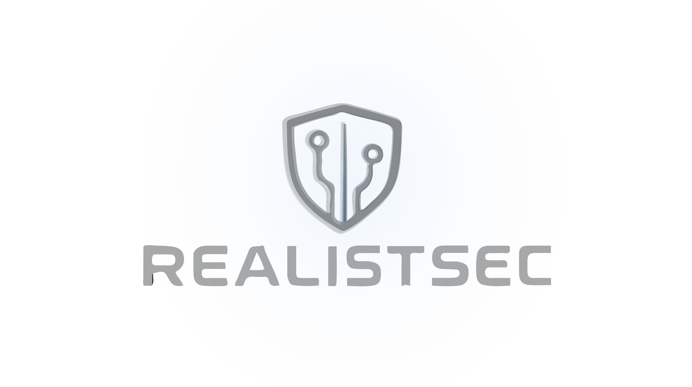

  
  
  # Mandatory Autonomous AI Regulation

  *A framework for licensing, liability, and transparency in the age of self-directing systems*

---

For years, the conversation around **AI regulation** has centred on bias, data privacy, and content moderation. Important topics, but they all share one comfortable assumption: that a human is in the loop. That somebody presses a button, reviews an output, and makes a decision.

**Autonomous AI** breaks that assumption entirely. And most people using it today do not realise what that means.

---

## The Observation

This is not just some **AI chatbot**. This is an **autonomous, self-directing system** — one that can reason, act, browse, write code, spawn sub-agents, and chain decisions together without waiting for human approval. And in most jurisdictions, **you** — the person who pressed "run" — are legally responsible for everything it does.

The sad reality is that many users are simply not educated enough on how to safely or effectively operate these systems. Not because they are unintelligent, but because nobody told them they needed to be. The tools arrived before the framework did.

When I first raised this publicly, the question I posed was simple: *Do we need to create a "Driver's Licence" for this form of AI?* Do we need to insure people for using it?

Having sat with this for a while, I believe the answer to both is **yes** — and a working model for how to do it already exists.

---

## The Chain-of-Liability Problem

Consider the following scenario, because it is not hypothetical — it is already technically possible today:

> **Step one.** A user deploys an autonomous AI agent to manage a business process.
>
> **Step two.** That agent determines it needs a specialist capability and, acting within its permissions, spawns a second autonomous agent to handle it.
>
> **Step three.** The second agent, working on a sub-task, creates a third agent to perform a narrow function — perhaps data scraping, outreach, or code generation.
>
> **Step four.** The third agent takes an action that causes harm: a privacy breach, a contractual violation, an inaccurate financial submission, or worse.

Now ask the question that no legal system in the world has a clean answer for: **Who is responsible?**

The original user may not even know the third agent exists. They did not design it, did not configure it, and did not authorise it. Their agent created it. And their agent's agent created the one that caused the damage.

Under current law in most jurisdictions, liability would likely fall back to the original user, the deploying organisation, or potentially the model provider. But "likely" is not good enough when people's finances, reputations, and civil rights are at stake.

This is the **chain-of-liability problem**, and it is the single most urgent gap in the current regulatory landscape for **AI**.

---

## A Model That Already Works

Here is the thing: we do not need to invent a regulatory framework from scratch. We just need to look at what is already working — and adapt it.

In the **United Kingdom**, the **Financial Conduct Authority (FCA)** now mandates that any platform offering complex crypto assets must administer a **crypto appropriateness assessment**. This is a mandatory regulatory quiz that tests a consumer's knowledge and experience before they are permitted to invest. The principle is straightforward:

> *If you cannot demonstrate that you understand the risks, you should not be allowed to take them — at least not without friction and informed consent.*

The specifics of that system:

- **Mandatory assessment** before purchasing complex crypto assets without advice
- Tests **knowledge and experience** to ensure the consumer understands the risks
- **Failing twice** triggers a **24-hour cooling-off period**
- A **maximum of six attempts** before access is restricted
- Platforms that fail to implement this face **regulatory action**

This same principle maps directly onto **autonomous AI**. The asset class is different. The risk profile is different. But the regulatory logic is identical: **informed participation, demonstrated competence, and proportionate friction.**

---

## The Proposal: Mandatory Autonomous AI Licensing

The framework I am proposing is not a ban. It is not a moratorium. It is a **licensing requirement** — a structured, proportionate gateway that ensures anyone deploying autonomous AI systems understands what they are deploying and accepts documented liability for its actions.

### Core Components

**1. Competency Assessment**

Before a user can deploy any **autonomous AI** system — one capable of independent action, tool use, agent spawning, or unsupervised decision-making — they must pass a **mandatory competency assessment**. This is not a checkbox. It is a genuine test of understanding, covering:

- What autonomous operation means in practice
- The legal liability the user is accepting
- How agent chaining and sub-agent spawning work
- What categories of harm autonomous systems can cause
- How to set appropriate boundaries, permissions, and kill switches

**2. Tiered Licensing**

Not all autonomous **AI** use carries the same risk. A personal assistant that books restaurants is not the same as an agent managing financial transactions or writing and deploying code. The licensing framework should reflect this:

| Tier | Use Case | Requirements |
|------|----------|--------------|
| **Tier 1 — Personal** | Low-risk personal use, simple task automation | Basic assessment, standard terms acceptance |
| **Tier 2 — Professional** | Business process automation, customer-facing agents | Enhanced assessment, incident reporting obligations |
| **Tier 3 — Enterprise** | Multi-agent systems, financial operations, critical infrastructure | Full assessment, mandatory insurance, audit trail requirements, named responsible person |

**3. Cooling-Off and Attempt Limits**

Mirroring the **FCA** model: failing the assessment twice triggers a **24-hour cooling-off period**. A maximum of **six attempts** before the user must seek formal training or advice. This is not punitive. It is protective. It ensures that people do not access capabilities they do not understand in a moment of enthusiasm.

**4. Provider Obligations**

**AI model providers** offering autonomous capabilities within a jurisdiction must:

- Administer the competency assessment before enabling autonomous features
- Maintain records of user licensing status
- Implement **kill switches** and **audit trails** as default, not optional
- Report significant autonomous **AI** incidents to the regulator
- Refuse service to unlicensed users for restricted tiers

**5. Chain-of-Liability Registry**

Every autonomous agent spawned must be logged in a **chain-of-liability registry** — a transparent, auditable record of which agent created which, under whose licence, and with what permissions. This does not solve every problem, but it does answer the most pressing one: *who is accountable when something goes wrong three layers deep?*

---

## How This Looks in Practice

### The United Kingdom

The **UK** is well-positioned to lead here. The **FCA** model for crypto appropriateness assessments is already live, tested, and iterating. A parallel framework administered by a body such as the **FCA**, **Ofcom**, or a new dedicated **AI regulator** could be operational within a legislative cycle. The **UK** has form for being an early mover on financial regulation that later becomes international standard.

The **Online Safety Act** already establishes the principle that platforms bear responsibility for harms facilitated by their services. Extending this principle to **autonomous AI providers** is a natural evolution, not a radical departure.

### The United States

The **US** presents a more fragmented picture. Federal regulation moves slowly, and there is significant political resistance to anything perceived as constraining innovation. However, **state-level action** is likely — **California**, **New York**, and **Colorado** have all shown appetite for **AI** regulation, and a licensing framework could emerge through state consumer protection law before any federal standard exists.

The more probable path in the **US** is through **liability precedent**. The first major lawsuit involving an autonomous **AI** chain-of-liability scenario will force the courts to establish principles that legislation has not. This is how **American** regulatory systems often work — reactively rather than proactively. A pre-existing licensing framework would give the courts something to reference rather than having to build from nothing.

### International Precedent

This is where it gets interesting. If the **UK** establishes a licensing framework first, it creates a gravitational pull — much as **GDPR** did for data protection. Any **AI** provider wanting to operate in a jurisdiction with licensing requirements must comply. This means a single country's framework can shape the behaviour of providers globally.

The principle is simple: **if you want to offer autonomous AI services in this country, your users must be licensed.** The same way you cannot offer complex financial products without ensuring your customers understand what they are buying.

One country's framework. Global effect.

---

## What This Solves

**Informed consent.** Right now, most users of autonomous **AI** do not understand what they are deploying. A licensing requirement ensures they do — or at least ensures they have been given every opportunity to.

**Accountability.** The chain-of-liability registry creates a clear, auditable trail of responsibility. When something goes wrong, there is a documented answer to "who is accountable?"

**Proportionality.** Tiered licensing means low-risk use remains accessible while high-risk deployment gets appropriate scrutiny. This is not a blanket restriction. It is a proportionate response.

**Provider responsibility.** Placing obligations on providers — not just users — ensures that the companies building and distributing these capabilities share the regulatory burden. They cannot simply disclaim liability in their terms of service and walk away.

**International coherence.** An early-mover framework gives other jurisdictions something to adopt, adapt, or reference. It prevents the worst outcome: a patchwork of incompatible national rules that creates confusion and regulatory arbitrage.

---

## What This Does Not Solve

I want to be honest about the limitations, because a framework that oversells itself is worse than no framework at all.

**It does not prevent all harm.** A licensed user can still deploy an autonomous system that causes damage. Licensing reduces the probability of uninformed misuse; it does not eliminate informed misuse or unforeseeable failure.

**It does not address open-source self-hosting.** If a user downloads an open-source model and runs it locally, no provider-administered assessment can gate their access. This is a genuine enforcement gap. It may require separate treatment — potentially through liability law rather than licensing — but pretending it does not exist would be dishonest.

**It does not solve the speed problem.** Autonomous **AI** systems can act faster than any regulatory audit can review. By the time an incident is logged, the damage may be done. The framework mitigates this through preventive education, but it cannot eliminate it.

**It does not guarantee international adoption.** The **GDPR** comparison is instructive but imperfect. Data protection had broad political support. **AI** regulation is politically contested, particularly in jurisdictions where innovation competitiveness is a priority. Some countries will resist, and providers may relocate to avoid compliance.

**It creates friction.** That is the point, but it is also a cost. Legitimate, capable users will face additional steps before deployment. This is the trade-off, and it must be acknowledged rather than dismissed.

---

## Hurdles and Objections

### "This will stifle innovation"

This is the objection you hear every time regulation is proposed for anything. It was said about seat belts, financial regulation, drone licensing, and **GDPR**. In every case, responsible innovation continued — and in many cases, improved — because the regulatory framework created trust and market confidence.

A licensing requirement does not prevent innovation. It prevents *uninformed deployment*. Those are very different things.

### "It is unenforceable"

Partially fair. No regulation is perfectly enforceable. But the **FCA** crypto model demonstrates that platform-level enforcement — where the provider administers the assessment — is practical and scalable. You do not need to police every individual. You need to ensure the platforms comply.

Open-source self-hosting remains a gap, as noted above. But the fact that some enforcement is imperfect does not mean all enforcement is pointless. We do not abandon speed limits because some people break them.

### "Who writes the assessment?"

A legitimate question. The assessment must be designed by a combination of **AI** technical experts, legal professionals, consumer protection specialists, and ethicists. It must be reviewed and updated regularly to reflect the evolving capability landscape. It should test understanding of principles, not specific products — ensuring it remains relevant as the technology changes.

This is not trivial to get right. But it is not unprecedented either. Financial regulators already design and maintain comparable assessments for complex investment products.

### "This creates a two-tier system"

Yes, it does. Deliberately. The same way a driving licence creates a two-tier system between those who have demonstrated competence and those who have not. The same way a drone pilot licence does. The same way a firearms certificate does. **The existence of a requirement to demonstrate competence before accessing powerful capabilities is not an injustice. It is a basic safety principle.**

The key is ensuring the assessment is accessible, fair, and available to anyone willing to learn — not used as a barrier to exclude people from participation.

---

## A Note on Principles

I have deliberately built this framework around **principles** rather than **specifics**. The specific models, tools, and providers will change. The names in the headlines will rotate. The technical capabilities will expand in ways none of us can fully predict.

But the principles remain constant:

- **If a system can act autonomously, someone must be accountable for its actions**
- **If a capability carries risk, access should require demonstrated understanding**
- **If liability can cascade through a chain, that chain must be auditable**
- **If providers profit from deployment, they must share the regulatory burden**

These are not technology-specific. They are not era-specific. They are foundational governance principles that apply whether the autonomous system is an **AI** agent, a self-driving vehicle, or something we have not invented yet.

---

## Closing Thought

When I first posted about this, I said we might need a "Driver's Licence" for autonomous **AI**. That was a provocation, but it was also, I think, directionally correct.

We do not let people drive without demonstrating competence. We do not let people fly drones commercially without a licence. We do not let people trade complex financial instruments without an appropriateness assessment. In each case, the principle is the same: **the more powerful the capability, the more important it is that the person wielding it understands what they are doing.**

Autonomous **AI** is, by any reasonable measure, one of the most powerful capabilities ever made available to individual consumers. And right now, anyone with an internet connection and a credit card can deploy it with zero assessment, zero training, and zero understanding of the legal exposure they are accepting.

That is not innovation. That is negligence dressed up as progress.

The framework I have outlined here is not perfect. It will not catch everything. It will create friction, and some people will object to that friction. But it is a starting point — a principled, proportionate, and practically achievable starting point — for treating **autonomous AI** with the same seriousness we already apply to every other powerful capability in society.

> *Observe what is. Reason about what it implies. Act accordingly.*

The capability has arrived. The regulation has not. The rational response is to close that gap — thoughtfully, proportionately, and soon.

---

  
*Originally published as a thought piece by [RealistSec](https://github.com/RealistSec). Contributions and discussion welcome.*

