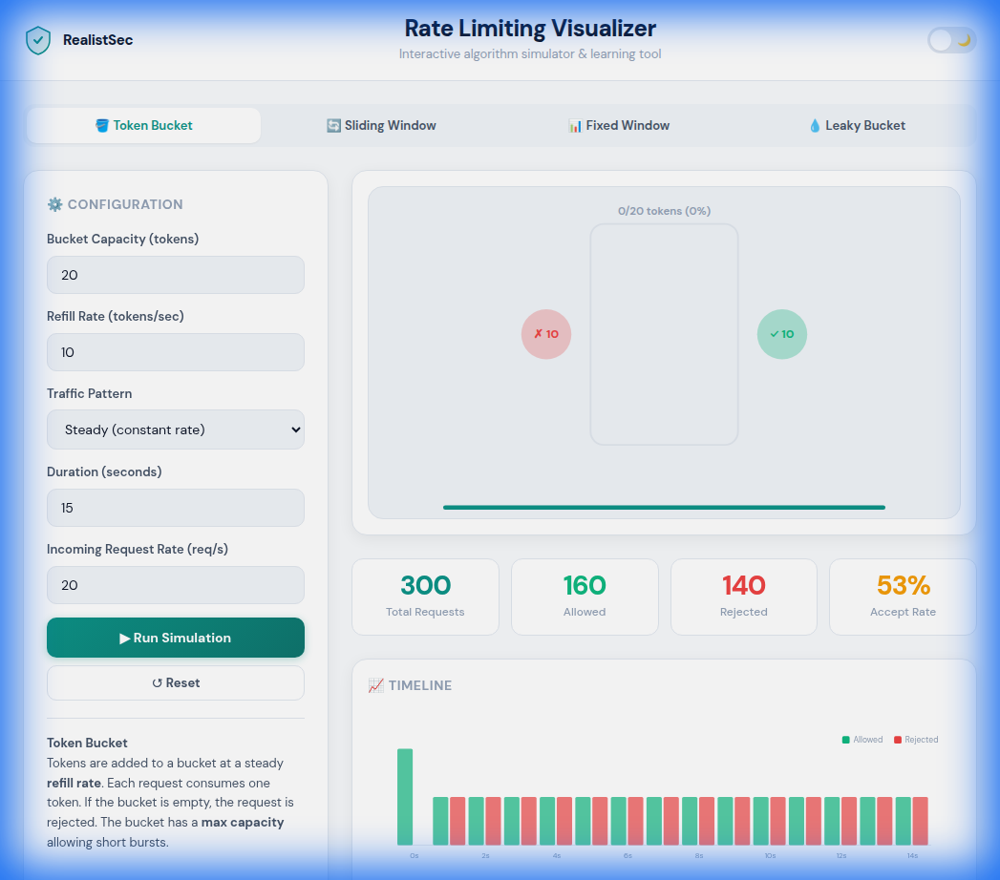

# Rate Limiting Visualizer

> **Interactive algorithm simulator for Token Bucket, Sliding Window, Fixed Window & Leaky Bucket rate limiting strategies.**



[](index.html)
[](index.html)
[](../../LICENSE)

---

## ✨ Features

- **4 Rate Limiting Algorithms** — Token Bucket, Sliding Window, Fixed Window, Leaky Bucket
- **5 Traffic Patterns** — Steady, Burst, Random, Ramp-up, Single Spike
- **Animated SVG Visualizations** — Real-time bucket fill/drain, sliding windows, bar charts
- **Live Statistics Dashboard** — Total requests, allowed, rejected, accept rate
- **Timeline Chart** — Visual history of allowed vs rejected requests per second
- **Code Snippets** — Ready-to-use rate limiting configs for Nginx, Express.js, Cloudflare Workers
- **Light/Dark Theme** — Toggle with saved preference via localStorage
- **Fully Offline** — Zero external JS dependencies; Google Fonts degrade gracefully to system fonts
- **SEO Optimised** — JSON-LD (WebApplication + FAQPage), Open Graph, Twitter Cards, semantic HTML5
- **Accessible** — ARIA labels, keyboard navigable, proper heading hierarchy
- **Single File** — One `index.html` file, works from USB sticks, local drives, or hosted

---

## 🚀 Quick Start

1. **Open** `index.html` in any modern browser
2. **Select** an algorithm tab (Token Bucket, Sliding Window, etc.)
3. **Configure** rate, capacity, traffic pattern, and duration
4. **Click** ▶ Run Simulation to watch the visualisation
5. **Explore** the timeline chart, stats, and code snippets below

> **💡 Tip:** Try different traffic patterns (Burst, Spike) to see how each algorithm handles traffic surges.

---

## 📊 Algorithms Explained

| Algorithm | Best For | Key Property |
|-----------|----------|--------------|
| **Token Bucket** | APIs needing burst allowance | Permits short bursts up to bucket capacity |
| **Sliding Window** | Fair, precise limiting | No boundary-burst exploits |
| **Fixed Window** | Simplest implementation | Resets counter at window boundaries |
| **Leaky Bucket** | Constant-rate output | Smooths all traffic to a uniform rate |

---

## 📁 Project Structure

```
rate-limiting-visualizer/
├── index.html          # Standalone tool (open in browser)
├── README.md           # This file
└── docs/
    ├── screenshot.png   # Tool screenshot
    ├── user-guide.md    # End-user guide
    └── dev-guide.md     # Developer/contributor guide
```

---

## 🔗 Links

- **Live Tool**: [realistsec.com/resources/rate-limiting-visualizer](https://realistsec.com/resources/rate-limiting-visualizer)
- **All Tools**: [realistsec.com/resources](https://realistsec.com/resources)
- **GitHub**: [RealistSec/resources](https://github.com/RealistSec/resources)

---

## 📜 License

Part of the [RealistSec Resources](https://github.com/RealistSec/resources) collection. See root [LICENSE](../../LICENSE) for details.

---

<p align="center">Built with ❤️ by <a href="https://realistsec.com">RealistSec</a></p>