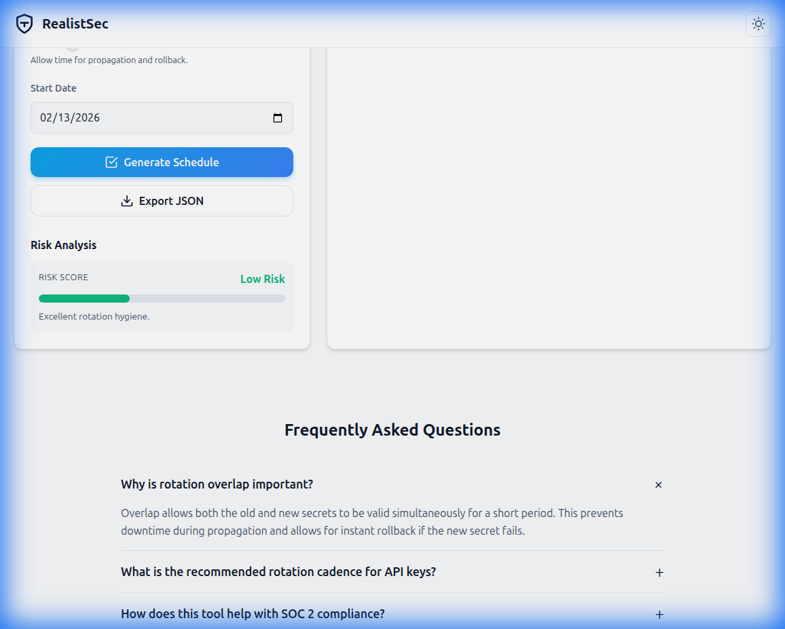

# Secrets Rotation Schedule Generator

> **Secure Plan. Compliant Rotation. Human Verified.**

A standalone, offline-capable tool to generate secure rotation schedules for API keys, passwords, and certificates. Visualize overlap windows, assess risk, and ensure compliance with SOC 2, PCI DSS, and NIST standards.

## Features

- **🛡️ Secure & Offline**: Runs entirely in the browser. No data is sent to any server.
- **📊 Interactive Timeline**: Visual Gantt chart showing valid periods, overlap windows, and revocation points.
- **⚖️ Risk Analysis**: Real-time risk scoring based on secret type, environment, and rotation cadence.
- **✅ Compliance Presets**: One-click configuration for SOC 2, PCI DSS, NIST, and ISO 27001.
- **🌗 Dark/Light Mode**: Fully responsive design with automatic theme persistence.
- **📤 Exportable Plans**: Download schedules as JSON for documentation or automation integration.
- **🔍 SEO Optimized**: Built with semantic HTML, JSON-LD structured data, and accessible metadata.

## Quick Start

1. Open `index.html` in any modern web browser.
2. Select your **Secret Type** (e.g., API Key, Database Password).
3. Choose your **Environment** (Production, Staging, etc.).
4. Adjust the **Rotation Cadence** and **Overlap Window**.
5. Click **Generate Schedule** to view your plan.

## Documentation

- [User Guide](docs/user-guide.md): Detailed instructions on using the tool.
- [Developer Guide](docs/dev-guide.md): Technical details and customization.

## License

MIT License. Free to use for personal and commercial projects.